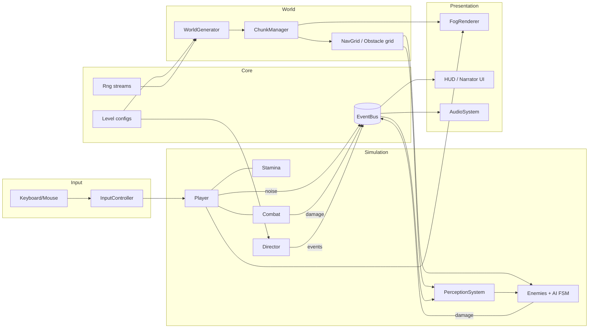
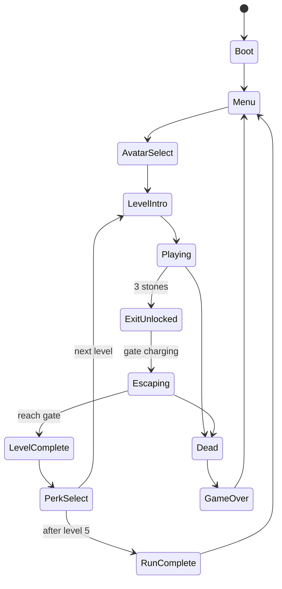

# The Lost: Architecture

> Version 0.1 · Companion to [product.md](./product.md)

## 1. Goals and constraints

- **Browser-first**, static hosting, zero backend.
- **60 FPS** on a mid-range laptop with integrated graphics.
- **Data-driven content**: adding a level, enemy, weapon, or event should be config work, not engine work.
- **Deterministic worlds** from a seed, so runs are reproducible, shareable, and testable.
- **Decoupled systems** communicating via a typed event bus, so AI, audio, UI, and the director don't import each other.
- **Pure logic is separate from rendering** so it can be unit tested without a canvas.

## 2. Tech stack

| Concern | Choice | Notes |
|---|---|---|
| Language | TypeScript (strict) | `noUncheckedIndexedAccess` on |
| Engine | Phaser 3 | Scenes, cameras, input, audio, arcade physics, render textures |
| Build | Vite | Fast HMR, static output |
| Noise | `simplex-noise` | Seeded via custom RNG |
| Tests | Vitest | Pure-logic unit tests; Playwright smoke test later |
| Lint/format | ESLint + Prettier | Enforced in CI |
| CI | GitHub Actions | lint, typecheck, test, build |
| Hosting | Vercel / Netlify / GitHub Pages | Static |
| Persistence | `localStorage` (versioned) | Settings, meta-progression, optional run save |

Physics: Phaser **Arcade** (circles and AABBs) is enough. Collision with the world uses a separate **obstacle grid** (bitset) for cheap LOS and pathfinding queries.

## 3. High-level design



**Rule:** simulation systems never touch presentation directly. They emit events; HUD, audio, and VFX subscribe.

## 4. Project structure

```
the-lost/
├─ src/
│  ├─ main.ts                    # Phaser config, boot
│  ├─ config/
│  │  ├─ constants.ts            # TILE_SIZE, CHUNK_SIZE, tuning defaults
│  │  ├─ levels/                 # level1.ts … level5.ts (LevelConfig)
│  │  ├─ enemies.ts              # EnemyDef table
│  │  ├─ weapons.ts              # WeaponDef table
│  │  ├─ events.ts               # GameEventDef table (director pool)
│  │  ├─ avatars.ts
│  │  ├─ perks.ts
│  │  └─ narrator.ts             # line pools
│  ├─ core/
│  │  ├─ EventBus.ts
│  │  ├─ rng.ts                  # mulberry32, hashSeed, Rng class
│  │  ├─ types.ts                # shared types
│  │  ├─ math.ts                 # vec helpers, angle utils
│  │  └─ storage.ts              # versioned localStorage
│  ├─ scenes/
│  │  ├─ BootScene.ts
│  │  ├─ MenuScene.ts
│  │  ├─ SelectScene.ts          # avatar select
│  │  ├─ GameScene.ts            # orchestrates a level
│  │  ├─ UIScene.ts              # HUD overlay (parallel scene)
│  │  ├─ PerkScene.ts
│  │  └─ GameOverScene.ts
│  ├─ world/
│  │  ├─ WorldGenerator.ts       # pure: seed + config → LevelData
│  │  ├─ biomes.ts
│  │  ├─ placement.ts            # stones, clues, decoys, spawns, loot
│  │  ├─ ChunkManager.ts         # load/unload chunk visuals
│  │  ├─ ObstacleGrid.ts         # bitset + LOS raycast
│  │  └─ Pathfinding.ts          # budgeted A* + flow field
│  ├─ entities/
│  │  ├─ Entity.ts               # base: id, pos, health, faction
│  │  ├─ Player.ts
│  │  ├─ enemies/
│  │  │  ├─ Enemy.ts
│  │  │  ├─ Wolf.ts  Hunter.ts  Lion.ts  Boss.ts
│  │  ├─ Projectile.ts
│  │  ├─ Pickup.ts
│  │  └─ Trap.ts
│  ├─ systems/
│  │  ├─ StaminaSystem.ts
│  │  ├─ CombatSystem.ts
│  │  ├─ PerceptionSystem.ts
│  │  ├─ ScentTrail.ts
│  │  ├─ Director.ts
│  │  ├─ FogRenderer.ts
│  │  ├─ LightingSystem.ts
│  │  ├─ AudioSystem.ts
│  │  ├─ DayNightSystem.ts
│  │  └─ SaveSystem.ts
│  ├─ ai/
│  │  ├─ StateMachine.ts
│  │  ├─ steering.ts
│  │  ├─ awareness.ts
│  │  └─ behaviors/ wolf.ts hunter.ts lion.ts boss.ts
│  ├─ ui/
│  │  ├─ Hud.ts  Minimap.ts  Narrator.ts  Vignette.ts  DebugOverlay.ts
│  └─ assets/                    # manifest + loaders
├─ public/                       # static assets (audio, images)
├─ tests/                        # vitest specs mirror src/
├─ docs/                         # optional deep-dives
└─ *.md                          # product, architecture, todo, documentation, README
```

## 5. Runtime model

### 5.1 Game loop

Simulation runs on a **fixed timestep (60 Hz)** with an accumulator inside `GameScene.update`. Rendering runs at display rate. This keeps AI, stamina, and combat deterministic and frame-rate independent.

```ts
const STEP = 1 / 60;
let acc = 0;

update(_t: number, deltaMs: number) {
  acc += Math.min(deltaMs / 1000, 0.1); // clamp to avoid spiral of death
  while (acc >= STEP) {
    this.simulate(STEP);
    acc -= STEP;
  }
  this.render(acc / STEP);
}

private simulate(dt: number) {
  this.input.poll();
  this.player.update(dt);
  this.stamina.update(dt);
  this.scent.update(dt);
  this.perception.update(dt);
  this.enemies.forEach(e => e.update(dt));
  this.combat.update(dt);
  this.director.update(dt);
  this.dayNight.update(dt);
}
```

### 5.2 System order (per tick)

`Input → Player → Stamina → Scent → Perception → Enemy AI → Combat → Director → DayNight → (render) Fog → Lighting → HUD`

### 5.3 Entities

Plain TypeScript classes with **composition**: components are small objects (`Health`, `Stamina`, `Awareness`, `Weapon`) attached to entities. Not a full ECS. If active AI count needs to exceed ~200, migrate hot paths to `bitECS`. (See ADR-002.)

### 5.4 Game flow



## 6. Core modules

### 6.1 Randomness and determinism

All gameplay randomness uses named, seeded streams so world generation is reproducible while other streams stay independent.

```ts
// core/rng.ts
export function mulberry32(seed: number): () => number {
  let a = seed >>> 0;
  return () => {
    a = (a + 0x6d2b79f5) >>> 0;
    let t = a;
    t = Math.imul(t ^ (t >>> 15), t | 1);
    t ^= t + Math.imul(t ^ (t >>> 7), t | 61);
    return ((t ^ (t >>> 14)) >>> 0) / 4294967296;
  };
}

export function hashSeed(seed: string | number, stream: string): number {
  const s = `${seed}:${stream}`;
  let h = 2166136261;
  for (let i = 0; i < s.length; i++) {
    h ^= s.charCodeAt(i);
    h = Math.imul(h, 16777619);
  }
  return h >>> 0;
}

export class Rng {
  private next: () => number;
  constructor(seed: string | number, stream: string) {
    this.next = mulberry32(hashSeed(seed, stream));
  }
  float(): number { return this.next(); }
  range(min: number, max: number): number { return min + (max - min) * this.next(); }
  int(min: number, maxInclusive: number): number { return Math.floor(this.range(min, maxInclusive + 1)); }
  chance(p: number): boolean { return this.next() < p; }
  pick<T>(arr: readonly T[]): T { return arr[Math.floor(this.next() * arr.length)] as T; }
  weighted<T>(items: readonly { item: T; weight: number }[]): T {
    const total = items.reduce((s, i) => s + i.weight, 0);
    let r = this.next() * total;
    for (const i of items) { if ((r -= i.weight) <= 0) return i.item; }
    return items[items.length - 1]!.item;
  }
}

// Streams: 'world', 'placement', 'loot', 'ai', 'director'
```

### 6.2 Event bus

```ts
// core/EventBus.ts
export class EventBus<E extends Record<string, unknown>> {
  private handlers = new Map<keyof E, Set<(payload: never) => void>>();

  on<K extends keyof E>(type: K, fn: (payload: E[K]) => void): () => void {
    let set = this.handlers.get(type);
    if (!set) { set = new Set(); this.handlers.set(type, set); }
    set.add(fn as (payload: never) => void);
    return () => set!.delete(fn as (payload: never) => void);
  }

  emit<K extends keyof E>(type: K, payload: E[K]): void {
    this.handlers.get(type)?.forEach(fn => (fn as (p: E[K]) => void)(payload));
  }
}

// core/types.ts
export interface NoiseEvent { x: number; y: number; radius: number; sourceId: string; kind: 'step' | 'attack' | 'shot' | 'hurt' | 'distraction' | 'breath' | 'fire'; }
export interface DamageEvent { sourceId: string; targetId: string; amount: number; knockback: number; kind: 'melee' | 'ranged' | 'trap' | 'env'; }

export type GameEvents = {
  noise: NoiseEvent;
  damage: DamageEvent;
  death: { id: string; faction: 'player' | 'enemy' };
  stoneCollected: { index: number; total: number };
  exitUnlocked: undefined;
  directorEvent: { id: string; narratorLine: string; durationSec: number };
  awarenessChanged: { enemyId: string; level: number; state: string };
  levelComplete: { levelId: number; timeSec: number };
};
```

### 6.3 Level configuration (single source of truth for difficulty)

```ts
// config/levels/types.ts
export type BiomeId = 'forest' | 'swamp' | 'savanna' | 'snow' | 'ruins';

export interface LevelConfig {
  id: number;
  name: string;
  biome: BiomeId;
  mapSize: { w: number; h: number };            // in tiles
  fog: { visionRadius: number; density: number; floor: number }; // px, 0..1, min darkness
  time: { startHour: number; dayLengthSec: number };
  stones: { count: 3; minDistFromSpawn: number; minDistBetween: number; decoys: number; guards: ('hidden'|'guarded'|'trapped')[] };
  clues: { perStone: number; vagueness: number };               // vagueness 0..1
  enemies: { type: EnemyType; count: number; aggression: number; speedMul?: number }[];
  loot: { weapons: number; healing: number; ammo: number };     // weights per chunk
  events: { intervalSec: [number, number]; pool: string[]; maxIntensityToRoll: number };
  escape: { chargeSec: number; waves: number };
  boss: { type: 'alphaLion' | 'chief' | 'guardian'; guardsStone: 1 | 2 | 3 } | null;
  audio: { ambience: string; music: string };
}

export type EnemyType = 'wolf' | 'hunter' | 'lion';
```

Example:

```ts
// config/levels/level2.ts
export const level2: LevelConfig = {
  id: 2,
  name: 'The Drowned Marsh',
  biome: 'swamp',
  mapSize: { w: 160, h: 160 },
  fog: { visionRadius: 200, density: 0.7, floor: 0.12 },
  time: { startHour: 17, dayLengthSec: 600 },
  stones: { count: 3, minDistFromSpawn: 60, minDistBetween: 45, decoys: 2, guards: ['hidden', 'guarded', 'trapped'] },
  clues: { perStone: 2, vagueness: 0.4 },
  enemies: [
    { type: 'wolf', count: 4, aggression: 0.5 },
    { type: 'hunter', count: 2, aggression: 0.6 },
  ],
  loot: { weapons: 0.3, healing: 0.4, ammo: 0.3 },
  events: { intervalSec: [90, 150], pool: ['fogSurge', 'packRelease', 'drums'], maxIntensityToRoll: 0.35 },
  escape: { chargeSec: 60, waves: 2 },
  boss: null,
  audio: { ambience: 'swamp_loop', music: 'tension_02' },
};
```

## 7. World generation

**Pure function:** `generateLevel(config, seed) → LevelData`. No Phaser imports, so it is fully unit-testable and snapshot-testable.

### 7.1 Pipeline

1. **Heightmap and moisture**: two simplex noise fields (octaves, seeded) → biome tile per cell via thresholds.
2. **Obstacles**: trees, rocks, water, ruins placed by noise + blue-noise (Poisson disk) sampling to avoid clumping.
3. **Landmarks**: place authored set pieces (ruined shrine, camp, watchtower, den) at valid sites.
4. **Spawn**: pick a safe spawn at a map edge or camp, with a cleared radius.
5. **Stones**: sample candidate sites that satisfy `minDistFromSpawn` and `minDistBetween`, ordered by path distance so Stone 1 is closest, Stone 3 is farthest.
6. **Solvability check**: flood-fill from spawn on the walkable grid; require every stone, the exit gate, and each clue site to be reachable. If not, carve a corridor or reroll with `seed + attempt`.
7. **Clues**: for each stone *n*, place clue(s) along a path from stone *n-1* (or spawn) pointing at stone *n*. Vagueness controls the angular error.
8. **Decoys**: fake stone sites with a trap or ambush.
9. **Enemy spawns**: territories (dens, camps) away from spawn, assigned to enemy groups with patrol routes.
10. **Loot**: weighted per chunk, ensuring a minimum starter kit within a radius of spawn.
11. **Exit gate**: placed far from spawn, outside stone clusters.

### 7.2 Output

```ts
export interface LevelData {
  seed: string | number;
  size: { w: number; h: number };
  tiles: Uint8Array;           // biome tile ids
  obstacles: Uint8Array;       // 0 = walkable, 1 = blocked, 2 = cover (blocks sight partly)
  surface: Uint8Array;         // noise multiplier class
  spawn: { x: number; y: number };
  exit: { x: number; y: number };
  stones: { x: number; y: number; guard: 'hidden'|'guarded'|'trapped'; decoy: boolean }[];
  clues: { x: number; y: number; targetStone: number; kind: string; text: string }[];
  enemyGroups: { type: EnemyType; home: {x:number;y:number}; patrol: {x:number;y:number}[]; count: number }[];
  loot: { x: number; y: number; id: string }[];
  landmarks: { x: number; y: number; kind: string }[];
}
```

### 7.3 Chunking

- Tile size 32 px, chunk 32×32 tiles (1024 px).
- `ChunkManager` keeps a ring of chunks around the player (radius 2-3) loaded.
- Each chunk bakes its ground tiles into a single `RenderTexture` or `Blitter`, and obstacles are pooled sprites y-sorted for depth.
- Unloaded chunks release textures to a pool. Game data (`LevelData`) stays in memory (a 256×256 level is under 1 MB).

## 8. Fog of war

Two parts, kept separate because they solve different problems.

### 8.1 Explored memory (persistent)

- A level-sized `CanvasTexture` at **1 pixel per tile** (256×256 max), where alpha encodes explored state.
- Each tick (throttled to ~10 Hz or when the player moves a tile), draw a filled circle at the player's tile with the live vision radius.
- Rendered as a world-space image scaled up by `TILE_SIZE` with linear filtering for soft edges, tinted dark, behind live vision.
- Stored as a `Uint8Array` for save/load and the minimap.

### 8.2 Live vision (per frame)

- A screen-sized `RenderTexture` overlay, redrawn each frame:
  1. Fill with the darkness color at `1 - floor`.
  2. Draw a radial-gradient sprite at the player's screen position using `Phaser.BlendModes.ERASE`, scaled to the current vision radius.
  3. Optional: additional erase sprites for light sources (torches, campfires).
- Vision radius is a smoothed value (`lerp`) driven by modifiers (night, events, perks, biome).

### 8.3 Gameplay visibility vs render visibility

Fog is **not just a visual**. Entities outside live vision are `setVisible(false)` and excluded from targeting and HUD. Light sources (a hunter's torch) can remain visible through fog as glow points, which is intended counterplay.

### 8.4 Line of sight

Grid raycast (DDA) on `ObstacleGrid`:

- `blocked` tiles stop rays.
- `cover` tiles (tall grass, bushes) don't stop rays but apply a detection penalty to anything standing inside.

## 9. Perception and AI

### 9.1 Perception system

Each enemy has an `Awareness` component with a value in `[0, 1]`.

```ts
// ai/awareness.ts
export interface Senses {
  sightRange: number;       // px
  fovRad: number;
  hearingMul: number;
  scent: boolean;
}

export function sightStimulus(
  enemy: { x: number; y: number; facing: number },
  player: { x: number; y: number; crouching: boolean; inCover: boolean },
  s: Senses,
  fogDensity: number,
  nightMul: number,
  los: (ax: number, ay: number, bx: number, by: number) => boolean,
): number {
  const dx = player.x - enemy.x, dy = player.y - enemy.y;
  const dist = Math.hypot(dx, dy);
  const range = s.sightRange * (1 - fogDensity * 0.6) * nightMul * (player.crouching ? 0.6 : 1) * (player.inCover ? 0.4 : 1);
  if (dist > range) return 0;
  const angle = Math.atan2(dy, dx);
  let diff = Math.abs(angle - enemy.facing) % (Math.PI * 2);
  if (diff > Math.PI) diff = Math.PI * 2 - diff;
  if (diff > s.fovRad / 2) return 0;
  if (!los(enemy.x, enemy.y, player.x, player.y)) return 0;
  return 1 - dist / range;   // closer = stronger
}

export function hearingStimulus(distToNoise: number, noiseRadius: number, hearingMul: number): number {
  const eff = noiseRadius * hearingMul;
  return distToNoise >= eff ? 0 : 1 - distToNoise / eff;
}
```

Awareness update per tick:

```
awareness += (max(sight, hearing, scent) * GAIN - DECAY) * dt
clamp 0..1
```

Thresholds (tunable per enemy): `<0.25` unaware · `0.25-0.6` suspicious → Investigate · `≥0.6` aware → Stalk/Chase. Losing awareness while aware transitions to `Search`, not straight to `Idle`.

### 9.2 Noise propagation

The player and combat systems emit `noise` events. `PerceptionSystem` subscribes, queries enemies within `radius` via a **spatial hash** (cell size 128 px), and queues stimuli. Surface multipliers apply at emit time.

### 9.3 Scent trail

- Ring buffer (max ~120 nodes) of `{x, y, age}` appended every ~24 px of movement, not over water.
- Wolves in `Investigate`/`Chase` sample nearby nodes and move toward the freshest one in range.
- Nodes expire at ~45 s. Herbs and water crossings clear nodes.

### 9.4 State machine

```ts
// ai/StateMachine.ts
export interface State<T> {
  name: string;
  enter?(owner: T): void;
  update(owner: T, dt: number): string | void;  // return next state name to transition
  exit?(owner: T): void;
}

export class StateMachine<T> {
  private current!: State<T>;
  constructor(private owner: T, private states: Record<string, State<T>>, initial: string) {
    this.transition(initial);
  }
  update(dt: number) {
    const next = this.current.update(this.owner, dt);
    if (next && next !== this.current.name) this.transition(next);
  }
  private transition(name: string) {
    this.current?.exit?.(this.owner);
    this.current = this.states[name]!;
    this.current.enter?.(this.owner);
  }
  get stateName() { return this.current.name; }
}
```

States: `Idle, Patrol, Investigate, Stalk, Chase, Attack, Search, Flee, Return` (enemy-specific subsets).

| Enemy | Notable behavior |
|---|---|
| Wolf | Pack roles: one **pressure** (direct), others **flank** (offset angle). Scent tracking. Retreats at 25% HP. |
| Hunter | Maintains range, uses cover, throws torch light, sets traps when `Search`ing. |
| Lion | `Stalk` at the fog edge, `Charge` burst (committed, straight line, can be dodged), then `Winded` recovery window. |
| Bosses | Phase-based FSM with telegraphed attacks and an arena hazard. |

### 9.5 Movement and pathfinding

- **Steering:** seek/arrive + separation (avoid stacking) + obstacle avoidance via nav grid.
- **Pathfinding:** grid A* with a binary heap, requests queued and processed under a **per-frame time budget (~1.5 ms)**. Paths are cached and re-requested only when the target moves beyond a threshold or every ~0.5 s.
- **Packs chasing the player:** a shared **flow field** computed from the player's tile, refreshed at ~4 Hz, avoids N separate A* searches.

## 10. Combat

- `CombatSystem` resolves hits using circle-vs-arc tests (melee) and circle-vs-circle (projectiles).
- Damage pipeline: `AttackIntent → HitResolution → DamageEvent → Health.apply → (Stagger/Knockback) → death check`.
- **I-frames** on dodge via a timestamp on the player's `Health` component.
- **Backstab** check: attacker within the target's rear arc (±60°) and target awareness < 0.6.
- **Durability** on weapons reduces per hit; broken weapons drop to fists.
- **Projectiles** are pooled (max ~64) and carry lifetime, speed, damage, and pierce.
- Hit feedback is event-driven: hit-stop (30-60 ms), small camera shake, audio. These subscribe to `damage` events and don't live in combat logic.

## 11. Director (the Game)

Tension-budget model:

```ts
// systems/Director.ts (core logic, UI-free)
update(dt: number) {
  // Raise on exposure, lower on calm
  const threats = this.perception.awareEnemyCount();
  this.intensity += (threats * 0.04 + this.recentDamage * 0.002) * dt;
  this.intensity -= this.cfg.relaxRate * dt;
  this.intensity = clamp01(this.intensity);

  this.cooldown -= dt;
  if (this.cooldown <= 0 && this.intensity <= this.cfg.maxIntensityToRoll) {
    const ev = this.rng.weighted(this.eligibleEvents());
    this.fire(ev);
    this.cooldown = this.rng.range(...this.cfg.intervalSec);
  }
}
```

- Events are `GameEventDef` records: `id, weight, minLevel, requires?, apply(ctx), revert?(ctx), narratorLines[], durationSec`.
- Fired events emit `directorEvent` on the bus. The narrator UI, audio, and the systems affected (fog, spawns, weather) respond.
- Events can be disabled in debug for deterministic testing.

## 12. Presentation systems

- **HUD (UIScene):** runs as a parallel Phaser scene, subscribed to the bus. Never reads simulation state directly except through a small read-only `HudModel` snapshot.
- **Lighting:** ambient tint by time-of-day + point lights (torches, fire) rendered into the fog's erase pass. No heavy per-pixel lighting needed.
- **Audio:** a small mixer with buses `music | sfx | ambience | narrator`. Positional SFX use distance attenuation and stereo pan relative to the camera center. Heartbeat gain follows the nearest aware enemy's distance.
- **Camera:** follows the player with deadzone and slight look-ahead toward the mouse. Zoom fixed per level (modifiable by perks).

## 13. Persistence

```ts
// core/storage.ts
const KEY = 'thelost.save.v1';

export interface SaveData {
  version: 1;
  settings: { volume: Record<string, number>; bindings: Record<string, string>; accessibility: Record<string, boolean> };
  meta: { unlockedAvatars: string[]; codex: string[]; bestTimes: Record<number, number> };
  run?: { seed: string; levelId: number; perks: string[]; avatar: string };
}
```

- Versioned with migrations (`migrate(v)`).
- Wrap `localStorage` in try/catch (private mode and quota errors).
- Autosave on level complete. Mid-level save is not in v1 (the world is regenerated from seed, but entity state isn't serialized).

## 14. Performance budget

| Item | Budget |
|---|---|
| Frame time | ≤ 16.6 ms (target 60 FPS) |
| Active AI entities | ≤ 60 |
| Loaded chunks | ≤ 25 (5×5) |
| Pathfinding | ≤ 1.5 ms/frame |
| Perception | ≤ 1.0 ms/frame (spatial hash + staggered updates) |
| Draw calls | < 200 |
| Memory | < 300 MB |

Techniques: object pooling (projectiles, particles, noise rings), staggered AI ticks (each enemy updates perception every 3rd tick), far-enemy simulation LOD (inactive enemies outside 2 chunks run a cheap wander), texture atlases, and avoiding per-frame allocations in hot paths.

## 15. Testing strategy

| Layer | Tooling | Examples |
|---|---|---|
| Pure logic | Vitest | RNG determinism, worldgen solvability across 500 seeds, stamina math, hearing/sight stimulus, director pacing, A* correctness |
| Snapshot | Vitest | `generateLevel(level1, 'seed-1')` hash stable across commits (guards unintended changes) |
| Integration | Vitest + headless Phaser (optional) | Scene boots, level loads |
| Smoke / E2E | Playwright (later) | Menu → start → move → no console errors |
| Manual | Playtest checklist in [todo.md](./todo.md) | Feel, readability, balance |

**Property test worth having:** for 500 random seeds per level config, every stone/exit/clue is reachable from spawn, and stones respect the distance constraints.

## 16. Build, CI, and deploy

- `npm run build` → Vite static bundle in `dist/`.
- CI on PRs: `lint → typecheck → test → build`.
- Deploy: push to `main` → Vercel/Netlify/GitHub Pages.
- Asset budget: initial load < 5 MB; audio streamed or lazy-loaded per level.

## 17. Debugging and tooling

URL params (dev and prod, harmless):

| Param | Effect |
|---|---|
| `?seed=abc123` | Fixed world seed |
| `?level=3` | Jump to level |
| `?debug=1` | Enable debug overlay (F3) |
| `?god=1` | Invulnerable (dev builds only) |
| `?noevents=1` | Disable director events |

Debug overlay (F3): FPS, entity counts, AI state labels, vision cones, noise rings, scent nodes, nav grid, chunk bounds, director intensity, stone/exit markers (reveal).

## 18. Architecture Decision Records

**ADR-001: Phaser 3 over raw Canvas/PixiJS.**
Built-in scenes, cameras, input, audio, and arcade physics let us ship a playable vertical slice quickly. PixiJS offers more rendering control but requires building these systems ourselves.

**ADR-002: Composition over full ECS.**
At ≤60 active AI entities, plain classes with components are simpler to read and debug. Revisit with `bitECS` if profiling shows entity iteration as a bottleneck.

**ADR-003: Event bus for cross-system communication.**
Decouples simulation from presentation and makes noise propagation, audio, and HUD trivially extensible. Cost: indirection, mitigated by typed events and a debug event log.

**ADR-004: Pure world generator.**
`generateLevel` has no engine dependency, enabling snapshot tests and a solvability property test, and is the foundation for daily-seed runs.

**ADR-005: Fixed-timestep simulation.**
Keeps AI and physics deterministic and consistent across refresh rates (60/120/144 Hz displays).

**ADR-006: Fog is gameplay, not just a shader.**
Entities outside vision are hidden and untargetable. The visual layer follows the simulation's rules, not the other way around.

**ADR-007: Data-driven levels/enemies/events.**
New content is config. Engine changes are reserved for new *mechanics*.

## 19. Open questions

- Do hunters share awareness (alert nearby hunters on sight)? Likely yes, with a radio-shout noise event.
- Should explored memory decay over time at higher difficulty?
- Gamepad aim: free stick vs. assisted lock-on.
- Web Worker for worldgen on 256×256 maps if generation exceeds ~300 ms on low-end devices.